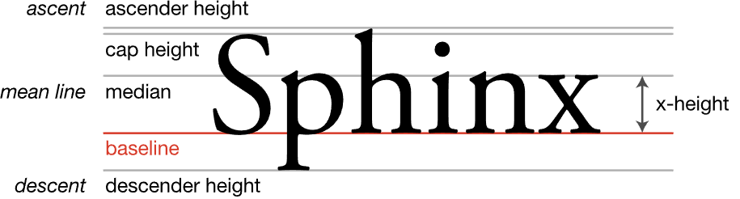

# Text Rendering Notes

## Industry standard

[slug](https://sluglibrary.com): Eric Lengyel's all-in-one solution. Has patented slug algorithim (free if you negotiate use on a free purpose, porting interface to X-Lang is problably non-trivial).  
[GNOME/pango](https://gitlab.gnome.org/GNOME/pango):  High-level do-it-all library.  
[Apple/Core Text](https://developer.apple.com/documentation/coretext/)  
[MicrosoftDocs/DirectWrite](https://github.com/MicrosoftDocs/win32/tree/docs/desktop-src/DirectWrite)  

## Composite Repos

[kb_text_shape](https://github.com/JimmyLefevre/kb): Unicode text segmentation and OpenType shaping by Jimmy Lefevre.

* [The modern text processing pipeline: Preface](https://www.newroadoldway.com/text0.html)
* [The modern text processing pipeline: Overview](https://www.newroadoldway.com/text1.html)
* [The modern text processing pipeline: Segmentation](https://www.newroadoldway.com/text2.html)
* [Affine KB notes (WIP)](https://app.affine.pro/workspace/3fc9d28f-0ee6-4e4c-9675-79230706f341/K77fm8VKq0?mode=edgeless)

[runic](https://github.com/jon-lipstate/runic): Odin community effort towards a all-in-one solution, ttf/opentype parser, shaper, renderer, and some other goodies.

* [Affine KB notes (WIP)](https://app.affine.pro/workspace/3fc9d28f-0ee6-4e4c-9675-79230706f341/k0IeZYbw3g?mode=edgeless)

[ColleagueRiley/RFont](https://github.com/ColleagueRiley/RFont): Claims to target better perforamnce than fontstash.
Decided to directly intergrate stb_truetype.h instead of keeping it separate (There is an option to define `RFONT_EXTERNAL_STB`).

[silnrsi/Graphite](https://github.com/silnrsi/graphite): "smart font" system developed specifically to handle the complexities of lesser-known languages of the world.  

[Host-Oman/libraqm](https://github.com/HOST-Oman/libraqm): A library for complex text layout

[hypernewbie/VEFontCache](https://github.com/hypernewbie/VEFontCache): VE Font Cache is a single header-only GPU font rendering library designed for game engines. (Uses harfbuzz and stb_truetype)

* [Ed94/VEFontCache-Odin](https://github.com/Ed94/VEFontCache-Odin): Ended up porting & overhauled this to Odin-lang
  * Uses a 4-layered atlas cache texture with CPU triangulated vert draw-list for very efficient but slightly reduced text quality.
  * Shader sample only supports greyscale anti-aliasing.
  * Shaper & Parser will be overridable. (Harfbuzz & stb_truetype for now)
  * [Affine KB docs (WIP)](https://app.affine.pro/workspace/3fc9d28f-0ee6-4e4c-9675-79230706f341/wHS6S1gUPW?mode=edgeless)

## Font Parsers

[JimmyLefevre/kb - kb_text_shape](https://github.com/JimmyLefevre/kb): Has a parser. Might be the best right now (perf wise).  
[jon-lipstate/runic](https://github.com/jon-lipstate/runic): See ttf package (WIP).  
[stb/stb_truetype](https://github.com/nothings/stb/blob/master/stb_truetype.h): Faster parsing and less bloated than freetype.  
[freetype](https://freetype.org)  
[englerj/odin-freetype](https://github.com/englerj/odin-freetype.git)  
[odin-lang/Odin/vendor/stb/truetype/stb_truetype.odin](https://github.com/odin-lang/Odin/blob/master/vendor/stb/truetype/stb_truetype.odin)  
[harfbuzz/ttf-parser (rust)](https://github.com/harfbuzz/ttf-parser)  
[redox-os/rusttype](https://github.com/redox-os/rusttype)  

[MSDN - True Type](https://learn.microsoft.com/en-us/typography/truetype/)  
[MSDN - OpenType Specification](https://learn.microsoft.com/en-us/typography/opentype/spec/)

[khaledhosny/ots - OpenType Sanitizer](https://github.com/khaledhosny/ots)

## Shapers

[harfbuzz](https://github.com/harfbuzz/harfbuzz): Industry standard all-in-one text shaping.  
[JimmyLefevre/kb - kb_text_shape](https://github.com/JimmyLefevre/kb): Has a shaper.  
[jon-lipstate/runic](https://github.com/jon-lipstate/runic): See shaper package (WIP).  
[hamza](https://github.com/saidwho12/hamza): Alternative WIP text shaper.  

[memononen/budouxc](https://github.com/memononen/budouxc): Word boundary detection for east-asian languages.  
[adah1972/libunibreak](https://github.com/adah1972/libunibreak): Grapheme and line-break detection.  

## Segmentation

[JimmyLefevre/kb - kb_text_shape](https://github.com/JimmyLefevre/kb): Has segmentation..? (Maybe not clustering)
[memononen/Skribidi](https://github.com/memononen/Skribidi): Bi-directional text stack for building UIs. Seems to be a nice all-in-one solution.  
[Fribidi](https://github.com/fribidi/fribidi): GNU Bi-directional detection.  
[Tehreer/SheenBidi](https://github.com/Tehreer/SheenBidi): Bi-directional detection.  
[unicode-org/icu](https://github.com/unicode-org/icu): Does quite a bit but specifically also does segmenting

## Renderers

[Chlumsky/msdfgen](https://github.com/Chlumsky/msdfgen)  
[fontdue](https://github.com/mooman219/fontdue)  
(Self-proclaimed "fastest rasterizer")

[fontstash](https://github.com/memononen/fontstash)  
Supported by sokol: [sokol/util/sokol_fontstash.h](https://github.com/floooh/sokol/blob/master/util/sokol_fontstash.h)  
There are several forks for fonstash... Going to elabroate on them in a separate [file](fontstash_forks.md)

[azsn/gllabel](https://github.com/azsn/gllabel): GPU Vector Text Rendering  
[jtsiomb/libdrawtext](https://github.com/jtsiomb/libdrawtext)  
[tomolt/libschrift](https://github.com/tomolt/libschrift)  
[bzt/scalable-font](https://gitlab.com/bztsrc/scalable-font): Scalable Screen Font renderer and file format specification  

* [bzt/scalable-font2](https://gitlab.com/bztsrc/scalable-font2)

[kevinmkchin/vertext](https://github.com/kevinmkchin/vertext)  

## Learning Resources

[npx-imx/gtec-demo-frameowrk/Doc/FslSimpleUI](https://github.com/nxp-imx/gtec-demo-framework/blob/master/Doc/FslSimpleUI.md)

[Implementing a Font Reader and Rasterizer from Scratch, Part 1: TTF Font Reader](https://handmade.network/forums/articles/t/7330-implementing_a_font_reader_and_rasterizer_from_scratch%252C_part_1__ttf_font_reader)

[LearnOpenGL - Text Rendering](https://learnopengl.com/In-Practice/Text-Rendering)  
[Improving Learn OpenGL's Text Rendering Example | Adventures in Coding](https://youtu.be/S0PyZKX4lyI)  
[Repo for above vod: johnWRS/LearnOpenGLTextRenderingImprovement](https://github.com/johnWRS/LearnOpenGLTextRenderingImprovement)

[GPU Gems 3: Chapter 25. Rendering Vector Art on the GPU](https://developer.nvidia.com/gpugems/gpugems3/part-iv-image-effects/chapter-25-rendering-vector-art-gpu)

[Writing a TrueType font renderer](https://axleos.com/writing-a-truetype-font-renderer/)

[Wikibooks/OpenGL_Programming/... Text Rendering 01](https://en.wikibooks.org/wiki/OpenGL_Programming/Modern_OpenGL_Tutorial_Text_Rendering_01)  
[02 of above](https://en.wikibooks.org/wiki/OpenGL_Programming/Modern_OpenGL_Tutorial_Text_Rendering_02)

[Simple good quality subpixel text rendering in OpenGL with stb_truetype and dual source blending](http://arkanis.de/weblog/2023-08-14-simple-good-quality-subpixel-text-rendering-in-opengl-with-stb-truetype-and-dual-source-blending)

## Examples

[Immediate-Mode-UI/Nuklear/nuklear_font.c](https://github.com/Immediate-Mode-UI/Nuklear/blob/master/src/nuklear_font.c)  
[raddebugger (non-trivial to digest solution)](https://github.com/Ed94/raddebugger)  
[refterm](https://www.youtube.com/playlist?list=PLEMXAbCVnmY6zCgpCFlgggRkrp0tpWfrn)  
[ocornut/imgui/imgui_draw.cpp#L4006](https://github.com/ocornut/imgui/blob/master/imgui_draw.cpp#L4006)  
[4coder-archive/4coder](https://github.com/4coder-archive/4coder.git)  
[gl-4.5-subpixel-text-rendering](https://github.com/arkanis/gl-4.5-subpixel-text-rendering/tree/17f4af4df858c52092ccad7c4292e7e4cd08091b)

## GPU Related

[GPU text rendering with vector textures](https://wdobbie.com/post/gpu-text-rendering-with-vector-textures/)  
[Efficient 2D Signed Distance Field Generation on GPU](https://astiopin.github.io/2019/01/06/sdf-on-gpu.html)  

* [demo of above - astiopin/sdf_atlas](https://github.com/astiopin/sdf_atlas)  

[GreenLighting/gpu-font-rendering](https://github.com/GreenLightning/gpu-font-rendering)  

[evanw/theta](https://github.com/evanw/theta)  
[Related article for theta's implementation](https://medium.com/@evanwallace/easy-scalable-text-rendering-on-the-gpu-c3f4d782c5ac)  

[MSDFGL - OpenGL-accelerated implementation of the multi-channel signed distance-field algorithm.](https://github.com/nyyManni/msdfgl)  
[andrewlowndes/perfect-antialiasing: Antialiasing via conservative rasterisation and analytical area computation](https://github.com/andrewlowndes/perfect-antialiasing)  

[GPU Gems 2: Chapter 42. Conservative Rasterization](https://developer.nvidia.com/gpugems/gpugems2/part-v-image-oriented-computing/chapter-42-conservative-rasterization)

* [Conservative Rasterization and Raster Order Views](https://ubm-twvideo01.s3.amazonaws.com/o1/vault/gdc2017/Presentations/Sathe_Rahul_RasterOrderViews.pdf)

### Vector Path Accelerators

[NV Path Rendering](https://developer.nvidia.com/nv-path-rendering-videos)  
[OpenVG](https://www.khronos.org/openvg/)  
[ajstarks/openvg](https://github.com/ajstarks/openvg)  
[ShivaVG: open-source ANSI C OpenVG](https://ivanleben.blogspot.com/2007/07/shivavg-open-source-ansi-c-openvg.html)  
[ileben/ShivaVG](https://github.com/ileben/ShivaVG)  
[amanithvg](https://www.amanithvg.com)

## Papers

[SIGGRAPH2007: Improved Alpha-Tested Magnification for Vector Textures and Special Effects](https://steamcdn-a.akamaihd.net/apps/valve/2007/SIGGRAPH2007_AlphaTestedMagnification.pdf)  
[Resolution Independent Curve Rendering using Programmable Graphics Hardware](https://www.microsoft.com/en-us/research/wp-content/uploads/2005/01/p1000-loop.pdf)  
[Higher Quality 2D Text Rendering](https://jcgt.org/published/0002/01/04/)  
[Wavelet Rasterization](https://people.engr.tamu.edu/schaefer/research/wavelet_rasterization.pdf)

### Metafont (Historical)

[Wikipedia](https://en.wikipedia.org/wiki/Metafont)  
[metaflop/metaflop-www](https://github.com/metaflop/metaflop-www)  
[Metapost](https://tug.org/metapost.html)

### Unicode

[Unicode Technical Reports](https://www.unicode.org/reports/)  
[International Components for Unicode](https://github.com/unicode-org/icu/tree/main)  

#### UTrie Accelerators

* [Wikipeida on Tries data structures](https://en.wikipedia.org/wiki/Trie)
* [UTrie3 experiments](https://docs.google.com/spreadsheets/d/e/2PACX-1vTgL260NFgmbiUAtptKj4fNf9wNm-OJ6Q0TbWzFWvhV7wVZk2Qe-gk2pbJh0pHY9XVsObZ3YaoOnb3I/pubhtml)
* [ICU Codepoint Tries](https://unicode-org.github.io/icu/design/struct/utrie)

### Forking Paths

[A Vector Graphics Renderer — part 1](https://forkingpaths.dev/posts/17-12-16/vector_graphics_p1.html)  
[A Vector Graphics Renderer — part 2](https://forkingpaths.dev/posts/17-12-21/vector_graphics_p2.html)  
[A Vector Graphics Renderer — part 3](https://forkingpaths.dev/posts/18-01-14/vector_graphics_p3.html)  
[Revisiting Vector Graphics on the GPU](https://forkingpaths.dev/posts/22-11-01/vector_graphics.html)  
[Orca Vector Graphics Backend](https://orca-app.dev/posts/240426/vector_graphics.html)

### Mr. 4th Programming

[Graphics 2[7] Baking Optimized Fonts Data](https://youtu.be/PQ-wJVjR4MU?list=PLT6InxK-XQvPYA_HLUozeyPGTjwcvYsBj)  
[Graphics [8]: Low Level Rendering API Part 1](https://youtu.be/C8gm9l4OJ9o?list=PLT6InxK-XQvPYA_HLUozeyPGTjwcvYsBj)  
[Graphics [9]: Low Level Rendering API Part 2](https://youtu.be/Na7pKMupsew?list=PLT6InxK-XQvPYA_HLUozeyPGTjwcvYsBj)  
[Graphics [10]: High Level Rendering API](https://youtu.be/jDUTWPEFvY0?list=PLT6InxK-XQvPYA_HLUozeyPGTjwcvYsBj)
...

### Tscoding

[ded editor](https://github.com/tsoding/ded)  
[Legendary Font Rendering](https://youtu.be/_t3mtjoHuoQ)  
[Rendering Text Editor on GPU](https://youtu.be/srV_l795O_s)  

[OpenGL Text Rendering for My Immediate UI Library - Offline Stream #02](https://youtu.be/mq3UXqPmBE8)

## Conceptual Overview for Typography

[Google Fonts: Typeface](https://fonts.google.com/knowledge/glossary/typeface)  
[Wikipeida - Outline](https://en.wikipedia.org/wiki/Template:Typography)  
[Wikipedia - Anatomy](https://en.wikipedia.org/wiki/Typeface_anatomy)  

[Sociology of Fonts - Defining the Terms Part 1: Anatomy](https://www.societyoffonts.com/2017/04/11/defining-the-termspart-1-anatomy/)  
[Sociology of Fonts - Defining the Terms Part 2: Process](https://www.societyoffonts.com/2017/04/18/defining-the-termspart-2-process/)  
[Sociology of Fonts - Defining the Terms Part 3: Categorization](https://www.societyoffonts.com/2017/04/25/defining-the-termspart-3-categorization/)

## Original Notes Header

The goal here was to find some solution that was small and preferrably interopped well with [odin-lang](https://odin-lang.org).
So, everything that was either not written in C or was not going to be an easy port, was ignored.

~~Now I just keep this in sync with anything I find while working on my fork of VEFontCache.~~

VEFontCache will most likely stay in a relatively "finished" state for the forseable future. Much of my interest have shifted to maybe utilizing the runic library when there is time to spruce it up.

### Interesting...

[MacType](https://github.com/snowie2000/mactype)
