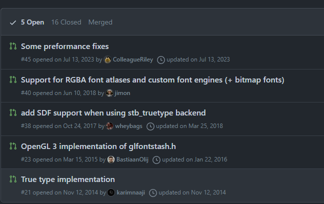

# fontstash forks

These are in chronological order.
Mostly focusing on stuff that doesn't look already merged in

## Aktau

[aktau/fontstash](https://github.com/aktau/fontstash)

Oldest (non-merged in) fork, has various changes nothing immediately notable...

Stopped: 2013

## nyorem

[nyorem/fontstash](https://github.com/nyorem/fontstash)

Seems to have C++ code but not dependent on it.

Changes:

* Bitmap font support
* Truetype font loading from memory
* Added ability to load an arbitrary number of fonts (not just four)
* Use multiple OpenGL textures for glyph caching (not just one)

Stopped: 2016

## starseeker

[starseeker/fontstash](https://github.com/starseeker/fontstash)

Various updates (old updates) to stb_truetype ver, manually merges in changes from BastiaanOlij(Bastian Olij) & Zammalad(Pil Sampson).

Stopped: 2017

### BastiaanOij

OpenGL 3 support, shadowed by starseeker's.

Stopped: 2016

## kthwaite

C++, ignoring

Stopped: 2017

## wheybags

[wheybags/fontstash](https://github.com/wheybags/fontstash)

Add SDF font support. Merged into suikki's (which stopped in 2018)

Stopped: 2017

## oov

[oov/fontstash](https://github.com/oov/fontstash/commits/master/)

Added ability to delete fonts

Stopped: 2018

## jimon

[jimon/fontstash](https://github.com/jimon/fontstash/tree/dmytro/bitmap_icons)

Custom font engine upport

Stopped: 2018

---

## All forks from here on are forked from the last commit from the original author

Everything not merged in:

